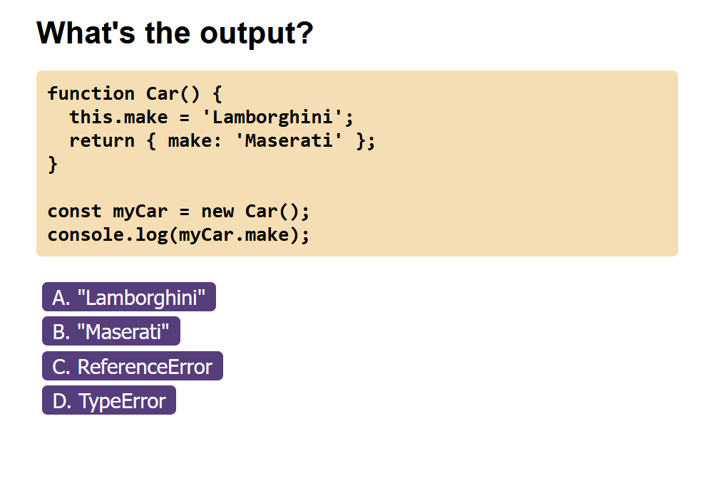

# Code Quiz

## Description

The aim of this coursework is to use JavaScript to make a JavaScript quiz. The application should:
- give the user a timed quiz on JavaScript.
- multiple choice answers should be given for each question.
- remove time when a question is answered incorrectly.
- allow the user to enter their initials to record their score.
- provide a list of high scores.

I created a C# script that I ran in [LinqPad](https://www.linqpad.net/) to convert the questions from mark-down to JSON. The C# script in included in the repo [here](./assets/data/question-extractor.cs).

The questions also include explanations so further work could be done to show the answered questions with their explanations when the score for the round is shown.

## Usage

The live application can be found at [https://fezzer.github.io/code-quiz/](https://fezzer.github.io/code-quiz/).

To take the quiz, click the "start quiz" button and answer as many questions as you can in one minute. Ten seconds will be deducted from your remaining time for every incorrect answer.

Here is a sample question:

## Credits

The questions were sourced from [lydiahallie](https://github.com/lydiahallie/javascript-questions).

The [tick](https://pixabay.com/vectors/check-correct-mark-choice-yes-ok-37583/) and [cross](https://pixabay.com/vectors/cross-mark-stop-button-warning-31176/) images were sourced from [pixabay.com](https://pixabay.com).

## License

PLease refer to the license in the repo.